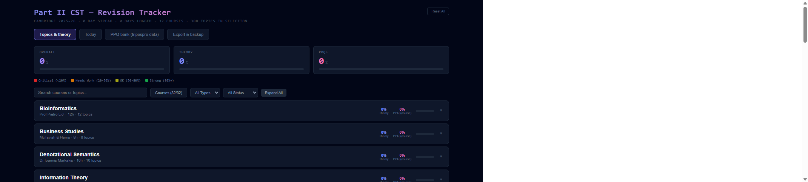
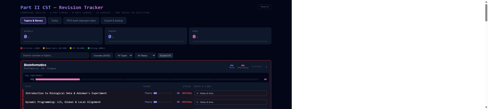
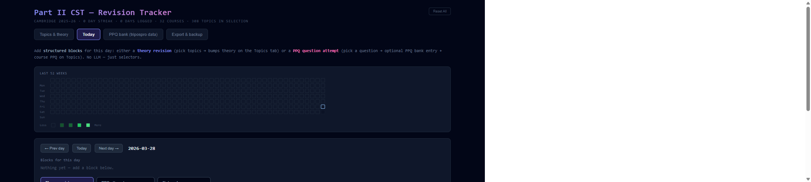
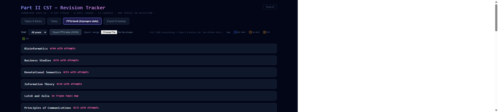
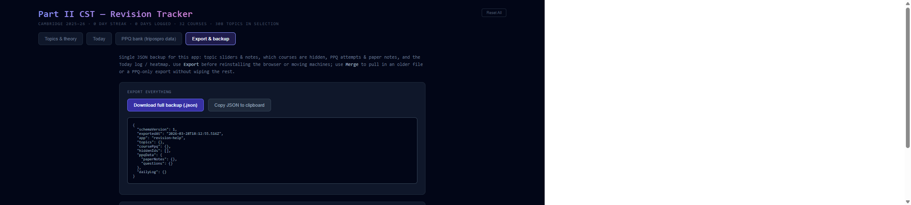

# Part II CST — Revision Tracker

Retrospective timetable with per-topic theory sliders, course PPQ confidence, a daily log with heatmap, a PPQ bank wired to Tripos Pro–style data, and JSON export/backup. Data lives in the browser (local storage).

## Run locally

```bash
npm install
npm run dev
```

Then open the URL Vite prints (usually `http://localhost:5173` — use another port if that one is busy).

## Screenshots

### Topics & theory

Overall scores, filters, and the course list. Expand a course to set theory and PPQ confidence per topic.





### Today

Daily blocks, streak context, and the last-52-weeks activity grid.



### PPQ bank

Past-paper attempts and notes by course, with year filters and import/export of PPQ JSON.



### Export & backup

Full-app JSON backup (topics, hidden courses, PPQ data, daily log) for moving machines or merging files.


